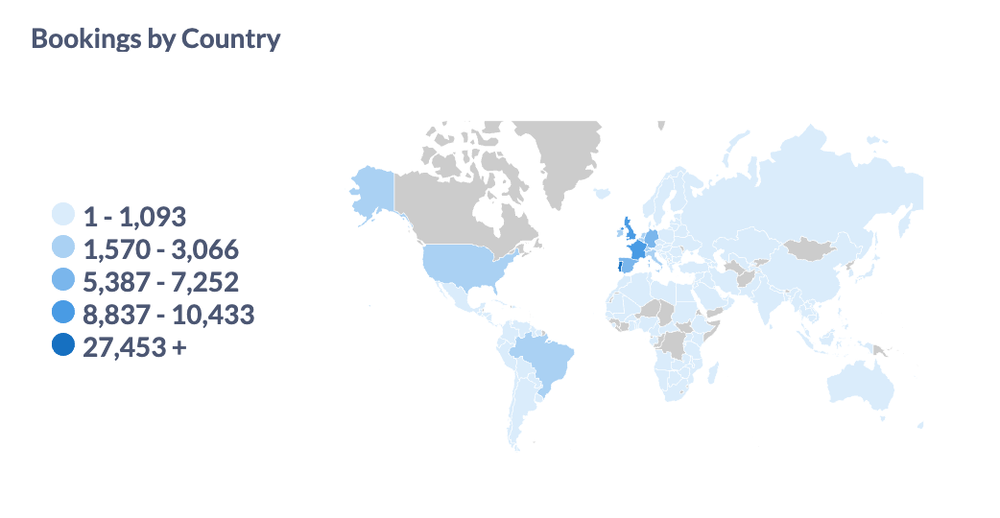
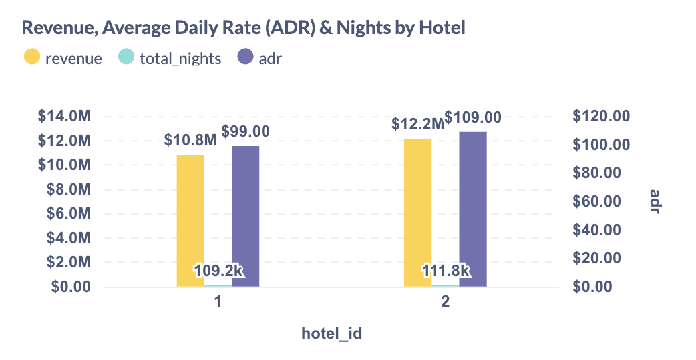
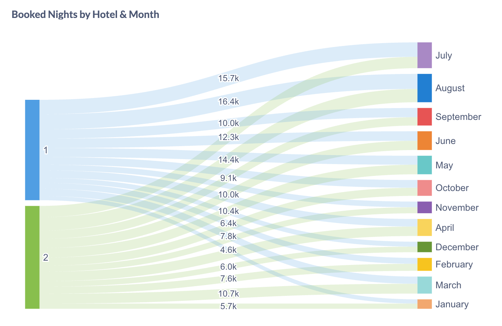
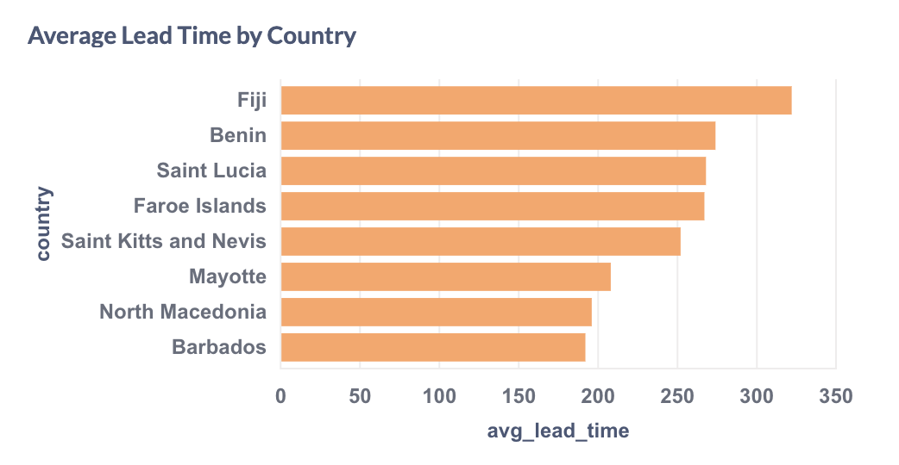
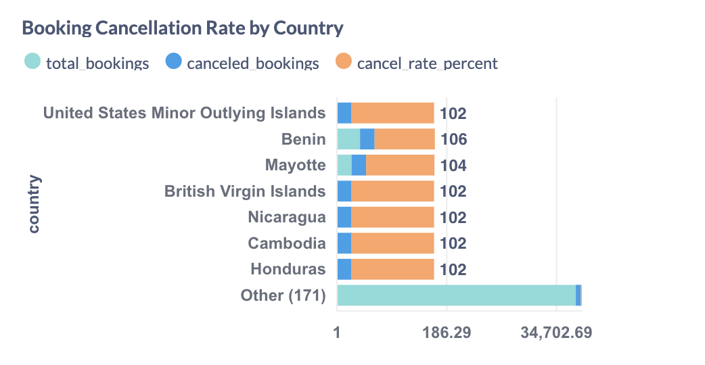

# 📊 KPI Metrics Implemented

### 1. 🌍 Bookings by Country

- **Insight**: Identifies top customer origins (e.g., UK, France, Portugal)
- **Metabase**: Region Map

---

### 2. 💸 Average Daily Rate (ADR) and Revenue by Hotel

- **Insight**: Shows hotel profitability and nightly rate (Hotel 2 has higher ADR and revenue)
- **Metabase**: Combined bar chart (Revenue, Nights, ADR)

---

### 3. 📅 Booked Nights by Hotel and Month

- **Insight**: Peak months (July, August) for both hotels
- **Metabase**: Sankey or Time Series chart

---

### 4. ⏰ Average Lead Time by Country

- **Insight**: Countries like Fiji and Benin book far in advance (300+ days)
- **Metabase**: Bar chart sorted descending

---

### 5. ❌ Booking Cancellation Rate by Country

- **Insight**: Highlights problematic regions with extremely high cancel rates
- **Metabase**: Stacked bar chart with cancellation overlay

